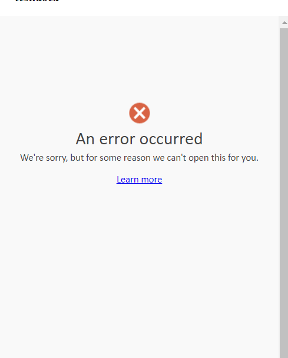

# Frontend for the markdown to docx converter
Connects with the backend. Provides markdown editors to splice into templates.
Generated document can be downloaded as docx or pdfs. Templates can be selected by a simple number.

### Addendum 10-11-2023
- After pdf generation has been re-prioritized, it does not make sense to go through the conversion step.
- Tried again with react-doc-viewer, still broken
- I also found an unofficial npm package @cyntler/react-doc-viewer. Going to check it out.

- Alas, no dice. Check the relevant branch for the code.
